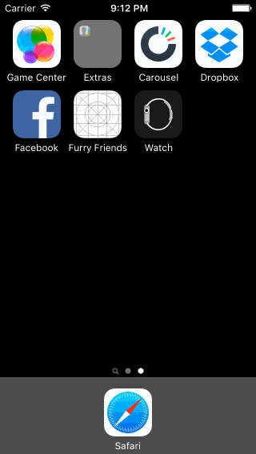

# Carousel App

This is an iPhone demo application showing the welcome flow, create account, sign in, and basic screens of the [Carousel iOS App](https://carousel.dropbox.com/). Built using Codepath's [Carousel  Tutorial](http://courses.codepath.com/courses/ios_for_designers/unit/2#!assignment).

Time spent: 11 hours spent in total

Completed user stories:

 * [x] Required: Static photo tiles on the initial screen
    * [x]  Optional: Photo tiles move with scrolling
 * [x] Required: Sign In
    * [x] Optional: When the keyboard is visible, if the user pulls down on the scrollview, it will dismiss the keyboard.
 * [x] Optional: Sign Up
    * [x] Optional: Tapping in the form reveals the keyboard and shifts the scrollview and "Create a Dropbox" button up.
    * [x] Optional: Tapping the Agree to Terms checkbox selects the checkbox.
    * [x] Optional: Tapping on Terms shows a webview with the terms.
    * [x] Optional: User is taken to the tutorial screens upon tapping the "Create a Dropbox" button.
 * [x] Required: Tutorial Screens
    * [x] Optional: User can page between the screens with updated dots
    * [x] Optional: Upon reaching the 4th page, hide the dots and show the "Take Carousel for a Spin" button.
 * [x] Required: Image Timeline
 * [x] Required: Settings

Walkthrough of all user stories:

GIF created with [LiceCap](http://www.cockos.com/licecap/).
